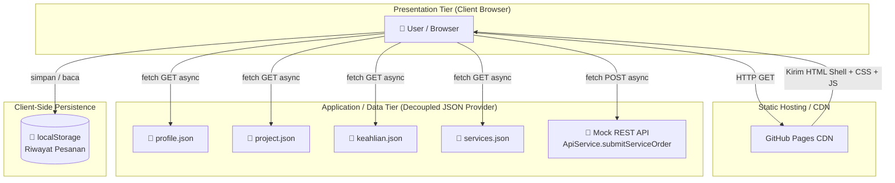

# Portofolio Web — Geralda Natali Gultom

Tugas Mandiri Minggu 2 — Mata Kuliah Pemrograman dan Pengujian Aplikasi Web (12S3101)
Institut Teknologi Del.

## Deskripsi
Halaman portofolio pribadi satu halaman (single page) yang menampilkan identitas
akademik, tabel riwayat proyek/pengalaman, daftar keahlian, dan formulir konsultasi
yang accessible, dibangun dengan HTML5 semantik dan CSS3 modern.

## Fitur
- Struktur semantik: `header`, `nav`, `main`, `section`, `article`, `aside`, `footer`
- Tabel data semantik lengkap (`caption`, `thead`, `tbody`, `tfoot`, `scope`)
- Daftar `ul` dan `ol`
- Formulir accessible dengan `fieldset`, `legend`, `label for`, dan validasi native
- Tata letak Flexbox & CSS Grid, responsif dengan media query
- Palet warna 60-30-10, sudut membulat, bayangan halus

## Sebelum vs Sesudah Integrasi Framework (Minggu 2 → Minggu 3)

| Aspek | Sebelum (Minggu 2) | Sesudah (Minggu 3) |
|---|---|---|
| Metode Styling | CSS murni ditulis manual dari nol | Bootstrap 5.3.3 + Custom CSS Overrides |
| Sistem Tata Letak | CSS Flexbox & Grid manual | Bootstrap Grid System 12-kolom (`container`, `row`, `col`) |
| Navigasi | Navbar statis tanpa animasi | Navbar `sticky-top` responsif dengan hamburger toggle otomatis |
| Ikon | Tidak ada ikon | Bootstrap Icons pada form dan tombol |
| Kartu Proyek | Kartu statis tanpa interaksi lanjutan | Kartu proyek terhubung ke Modal Dialog untuk detail lengkap |
| Formulir | Label statis di atas input | Floating Labels, Input Group berikon, validasi visual otomatis |
| Tema Warna | CSS variable personal saja | CSS variable personal + override variabel Bootstrap (`--bs-primary`) tanpa `!important` |
| Responsivitas | Media query manual (`@media max-width`) | Breakpoint bawaan Bootstrap (`col-md`, `col-lg`) otomatis multi-perangkat |
| Manajemen Versi | Branch `main` saja | Branch terpisah `week3-bootstrap` untuk isolasi eksperimen |

## Screenshot Tampilan Terbaru

![Screenshot Portofolio B
ootstrap]

## Live Demo (Versi Bootstrap)

[(https://geraldagultom.github.io/ppw-2026-week2-12S24051/)]

## Cara Menjalankan
1. Clone repositori ini
2. Buka `index.html` di browser (atau gunakan ekstensi Live Server di VS Code)

## Live Demo
https://geraldagultom.github.io/ppw-2026-week2-12S24051/ 

## Screenshot

---

## 🏗️ Arsitektur Sistem — Minggu 4

### Diagram C4 Container Model

### Narasi Separation of Concerns

Arsitektur Minggu 4 ini memisahkan tanggung jawab sistem menjadi tiga lapisan independen.
**Presentation Tier** (browser) hanya bertugas menampilkan antarmuka dan menangani
interaksi pengguna, tanpa menyimpan satu pun data permanen di dalamnya. **Application/Data
Tier** disimulasikan melalui penyedia data JSON modular (`profile.json`, `project.json`,
`keahlian.json`, `services.json`) serta mock REST endpoint (`ApiService.submitServiceOrder`),
yang bertindak sebagai kontrak data terstandarisasi — apabila suatu saat data ini dipindah ke
backend sungguhan, lapisan presentasi tidak perlu diubah sama sekali karena komunikasi
tetap melalui `ApiService`. Lapisan ini sejalan dengan `js/api-service.js` yang secara
khusus memisahkan logika pengambilan data (Data Access Layer) dari logika penyajian
antarmuka (`js/app.js`, Presentation Layer). Terakhir, **Client-Side Persistence**
menggunakan `localStorage` untuk menyimpan riwayat pesanan secara lokal di sisi
pengguna tanpa memerlukan basis data server.

### Sebelum vs Sesudah Refactoring (Minggu 3 → Minggu 4)

| Aspek | Sebelum (Minggu 3) | Sesudah (Minggu 4) |
|---|---|---|
| Sumber Data | Hardcoded langsung di `index.html` | Modular JSON (`profile.json`, `project.json`, `keahlian.json`, `services.json`) |
| Rendering Konten | Statis, ditulis manual | Dynamic Client-Side Rendering via `fetch()` + `async/await` |
| Modal Detail Proyek | 4 elemen modal terpisah di HTML | 1 Universal Modal, konten diinjeksi dinamis berdasarkan ID |
| Status Antarmuka | Tidak ada penanganan khusus | 4 UI States: Loading, Success, Empty, Error |
| Filter Kategori | Tidak ada | Filter kategori proyek secara instan (client-side) |
| Formulir | Submit standar (berpotensi reload) | Asinkron penuh (`e.preventDefault()`), tanpa reload halaman |
| Feedback Form | Pesan validasi bawaan browser | Bootstrap Toast dinamis + status tombol loading |
| Persistensi Data | Tidak ada | Riwayat pesanan tersimpan di `localStorage`, reaktif di badge navbar |
| Keamanan Render | Belum ada perlindungan khusus | Sanitasi via `escapeHTML()` mencegah DOM-based XSS |
| Struktur Folder | Flat (semua di root) | Modular: `/data`, `/js`, `/labs`, `/css` atau root `style.css` |

### Pengukuran Performa Jaringan (DevTools)

| Metrik | Cold Load (Disable Cache ON) | Warm Load (Cache Aktif) |
|---|---|---|
| Jumlah Request | 23 requests | 23 requests |
| Data Ditransfer | 380 kB | 2.2 kB |
| Ukuran Total Resource | 719 kB | 719 kB |
| Waktu Finish | 24.06 s | 59 ms |
| DOMContentLoaded | 3.86 s | 52 ms |
| Waktu Load Total | 24.07 s | 53 ms |
| Status index.html | 200 OK (full download) | 304 Not Modified |
| Status bootstrap.min.css | 200 OK (3.82 s, 33.6 kB) | 200 (disk cache, 6 ms) |
| Status data JSON (project.json, dll) | 200 OK (±3-8 ms masing-masing) | 304 Not Modified |
| Status gambar thumbnail proyek | 200 OK (±6s, karena antre di belakang font) | 200 (memory cache, 0 ms) |

**Catatan analisis:** Perbedaan performa antara cold load dan warm load pada proyek ini
sangat ekstrem. Pada cold load, seluruh berkas — termasuk font Google Fonts dan ikon
Bootstrap — diunduh penuh dari awal, menyebabkan waktu pemuatan total mencapai 24.07
detik dengan 380 kB data ditransfer. Salah satu penyumbang waktu terbesar adalah berkas
font `bootstrap-icons.woff2` yang memakan waktu lebih dari 20 detik untuk diunduh penuh,
menunjukkan bahwa aset eksternal berukuran besar dapat menjadi bottleneck utama pada
kunjungan pertama. Sebaliknya, pada warm load, dengan cache browser diaktifkan kembali,
waktu pemuatan total anjlok drastis menjadi hanya 53 milidetik — lebih dari 450 kali lebih
cepat — dengan data yang ditransfer berkurang hingga 99.4 persen menjadi 2.2 kB saja.
Hal ini membuktikan bahwa strategi caching browser memiliki dampak sangat signifikan
terhadap pengalaman pengguna pada kunjungan berulang, khususnya untuk aset statis yang
jarang berubah seperti pustaka Bootstrap dan font eksternal. Pada warm load, berkas
`index.html`, `style.css`, serta seluruh data JSON provider menunjukkan status `304 Not
Modified`, membuktikan server tetap divalidasi namun tidak perlu mengirim ulang konten
penuh karena tidak ada perubahan.

### Live Demo (Minggu 4 — Dynamic CSR)

[Isi link GitHub Pages branch week4-architecture di sini setelah deploy]