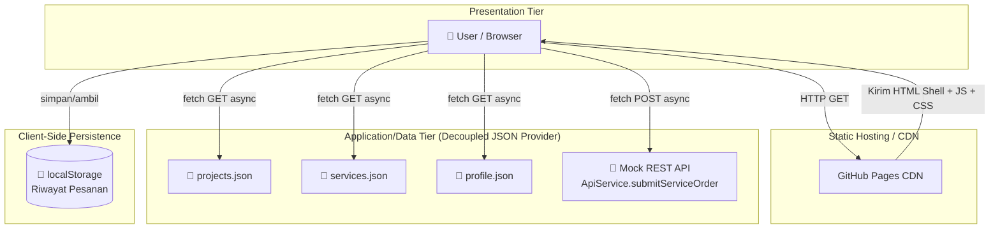

# Lab 1: C4 Container Diagram - Portofolio Geralda

```mermaid
graph TD
    User[👤 User / Browser] -->|HTTP GET| CDN[GitHub Pages CDN]
    CDN -->|Kirim HTML Shell + JS + CSS| User
    User -->|fetch GET async| JSON1[📄 projects.json]
    User -->|fetch GET async| JSON2[📄 services.json]
    User -->|fetch GET async| JSON3[📄 profile.json]
    User -->|fetch POST async| API[🔌 Mock REST API<br/>ApiService.submitServiceOrder]
    User -->|simpan/ambil| LS[(💾 localStorage<br/>Riwayat Pesanan)]

    subgraph "Presentation Tier"
        User
    end
    subgraph "Static Hosting / CDN"
        CDN
    end
    subgraph "Application/Data Tier (Decoupled JSON Provider)"
        JSON1
        JSON2
        JSON3
        API
    end
    subgraph "Client-Side Persistence"
        LS
    end
```